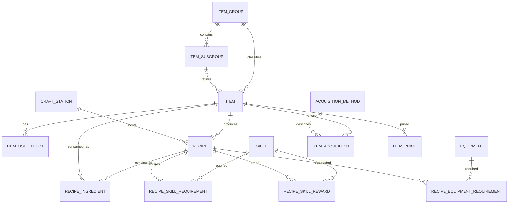

# Архитектура

## 1. Слои

```text
main.py
  app.bootstrap             конфигурация, каталоги, логирование, миграции
  app.ui                    окна, диалоги, составные widgets
  app.services              сценарии приложения, валидация, изображения, backup
  app.repositories          запросы и операции хранения
  app.models                SQLAlchemy entities и enums
  app.database              engine/session/migration plumbing
```

UI не работает с SQL напрямую. Транзакционная граница находится в сервисах/репозиториях. Формы используют DTO-подобные словари/датаклассы и сохраняют агрегат предмета одной транзакцией. Новые имена ингредиентов передаются как `PendingItemDraft` с временными отрицательными ID; `BuilderService` создаёт реальные Item, заменяет временные ссылки и валидирует/сохраняет весь рецепт в той же транзакции.

## 2. ER-модель



Проверки ключевых требований:

- несколько рецептов одного предмета: `recipe.result_item_id` — не уникален, связь `Item.recipes` 1:N;
- несколько способов получения: `item_acquisition` — связующая таблица с составной уникальностью, связь M:N;
- ингредиент: `recipe_ingredient.item_id` — обязательный FK на `item.id`, свободного имени нет;
- будущее рекурсивное построение цепочки возможно переходами `RecipeIngredient.item_id → Item.recipes`.
- прямые и косвенные циклы данных допустимы на уровне редактора; будущий обход Craft Engine должен вести множество посещённых узлов и сообщать о цикле вместо бесконечной рекурсии.

## 3. Таблицы и ограничения

### Справочники

`craft_station(id, name, name_key, description, sort_order, is_active)`  
`item_group(id, name, name_key, sort_order)`  
`item_subgroup(id, group_id, name, name_key, sort_order)`  
`skill(id, name, name_key, description, is_active)`  
`equipment(id, name, name_key, image_path, description, is_active)`  
`acquisition_method(id, code, name, name_key, sort_order, is_active)`

Имена основных справочников уникальны без учёта регистра через SQLite `NOCASE`. Подгруппа уникальна в пределах группы. Код способа уникален и стабилен.

### Предмет

`item(id, name, name_key, group_id, subgroup_id, rank, item_class, image_path, notes, is_active, is_consumable, created_at, updated_at)`

`name_key` — внутренний Unicode-нормализованный ключ (`NFKC + casefold`). В справочниках он защищает уникальность русских имён, в Item обеспечивает регистронезависимый SQL-поиск. В UI поле не показывается.

`item_use_effect(id, item_id, effect_type, value, max_uses)`

Ограничение приложения и БД проверяет согласованность группы и подгруппы; составной внешний ключ не применяется, чтобы не усложнять ORM, проверка выполняется сервисом и тестируется.

### Рецепт

`recipe(id, result_item_id, craft_station_id, output_quantity, energy_cost, notes, is_active, created_at, updated_at)`

`recipe_ingredient(id, recipe_id, item_id, quantity, UNIQUE(recipe_id, item_id))`

`recipe_skill_requirement(id, recipe_id, skill_id, required_level, UNIQUE(recipe_id, skill_id))`

`recipe_skill_reward(id, recipe_id, skill_id, experience_amount, UNIQUE(recipe_id, skill_id))`

`recipe_equipment_requirement(id, recipe_id, equipment_id, quantity, UNIQUE(recipe_id, equipment_id))`

### Получение и цены

`item_acquisition(id, item_id, method_id, details, UNIQUE(item_id, method_id))`

`item_price(id, item_id, price_type, price, updated_at, UNIQUE(item_id, price_type))`

`details` зарезервировано только для описания конкретного источника (например, имя торговца); оно не заменяет структурированные поля и не используется в расчёте типа получения. Тип цены хранится стабильным строковым кодом (`TRADER`, `AUCTION`) и расширяем без миграции справочника.

## 4. Числа и время

- Измеряемые игровые значения и деньги: `NUMERIC(18, 4)` → Python `Decimal`.
- `max_uses`: integer, так как это дискретное число применений.
- Даты: timezone-aware UTC в логике; SQLite хранит совместимый timestamp. UI показывает локальное время.
- Форматирование убирает завершающие нули.
- Изображение из clipboard кодируется UI во временный PNG с автоматическим удалением. Дальше оно проходит существующий path-based `ImageService`, поэтому постоянное хранение, атомарная замена и относительный путь в БД одинаковы для выбранного файла и вставленного скриншота.

## 5. Политика удаления

- Все FK включены через `PRAGMA foreign_keys=ON`.
- Ссылки между корневыми игровыми сущностями используют `ON DELETE RESTRICT`.
- Дочерние строки агрегата (`ItemUseEffect`, строки удаляемого Recipe, acquisition и price удаляемого Item) используют ORM delete-orphan/контролируемый `CASCADE` только после явного подтверждения удаления владельца.
- Предмет нельзя удалить, если он является ингредиентом. Предмет-результат удаляется только после явного удаления его рецептов в рамках подтверждённой операции.
- Справочник нельзя удалить при ссылках. UI показывает число и вид зависимостей.

## 6. Миграции и запуск

Alembic содержит три последовательные ревизии схемы: начальную реляционную, Unicode-ключи справочников и поисковый ключ Item. На старте приложение выполняет `upgrade head`, затем идемпотентно добавляет системные способы `FIND`, `TRADER`, `AUCTION`, `CRAFT`. SQLite-файл не пересоздаётся. При программном запуске Alembic не перенастраивает root logger: desktop-процесс сохраняет собственный `RotatingFileHandler` для `logs/app.log`; консольная команда Alembic использует свою конфигурацию. Перед несовместимой будущей миграцией обязательны запись в `DECISIONS.md`, анализ существующей схемы и backup.

## 7. Производительность

- Индексы на FK, `item.name`, `item.rank`, `item.item_class`, `acquisition_method.code`, `item_price.price_type`.
- Поиск и фильтрация выполняются одним SQL-запросом с `EXISTS`, без загрузки всех рецептов.
- Списки используют ленивое обновление/ограничение выборки там, где это требуется; первая версия загружает только краткие данные дерева, полную карточку — по выбору.
- SQLAlchemy eager loading применяется точечно для карточки, чтобы избежать N+1.

## 8. Безопасное редактирование

- Одна сессия/транзакция на операцию, rollback при исключении.
- Форма держит черновик до `Сохранить`.
- Картинка сначала копируется во временно безопасное назначение; при неуспешной транзакции новый неиспользуемый файл удаляется, старый удаляется только после успешного сохранения/явного удаления.
- Быстрая цена — отдельная короткая транзакция upsert.
- Backup выполняется SQLite API после проверки целостности подключения.
- При быстром вводе ингредиента UI использует временные отрицательные ссылки только в памяти. `BuilderService` внутри одной транзакции создаёт отсутствующие `ItemGroup`, затем `ItemSubgroup`, затем `Item`, заменяет временные ссылки реальными положительными ID и только после этого валидирует и сохраняет `RecipeIngredient`. Ни один временный ID не записывается в SQLite.
- Списки справочников в форме являются обновляемыми представлениями, а не источником истины. После закрытия менеджера справочников `IdComboBox` перечитывает варианты, сохраняет валидный выбранный ID либо разрешает видимый текст по нормализованному имени. Динамические строки рецепта при этом не уничтожаются.

## 9. Режимы доступа

`AppMode` хранится в памяти. По умолчанию запускается Viewer. Локальный хэш пароля/настройка хранится отдельно от игровой БД в `data/settings.json`; начальный пароль документирован и предлагается сменить через настройки. UI скрывает действия, а сервисы дополнительно требуют административный контекст для мутаций игровых данных. Цена `AUCTION` разрешена в обоих режимах.
